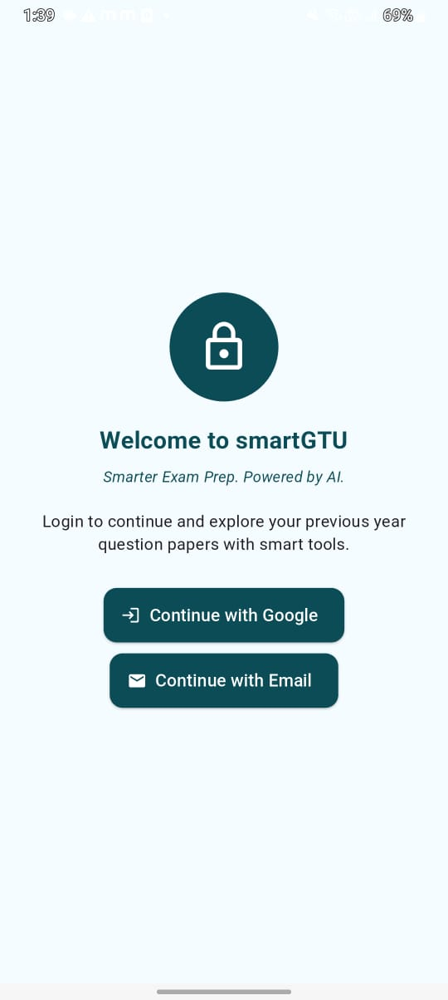
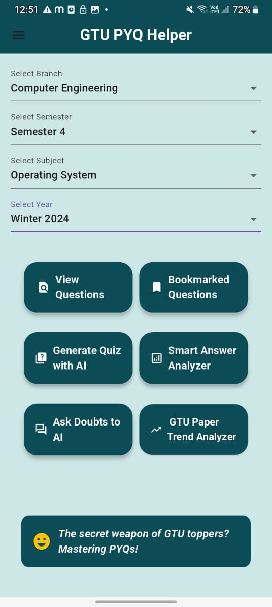
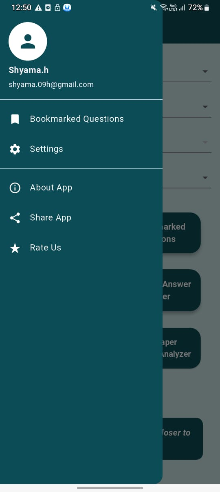
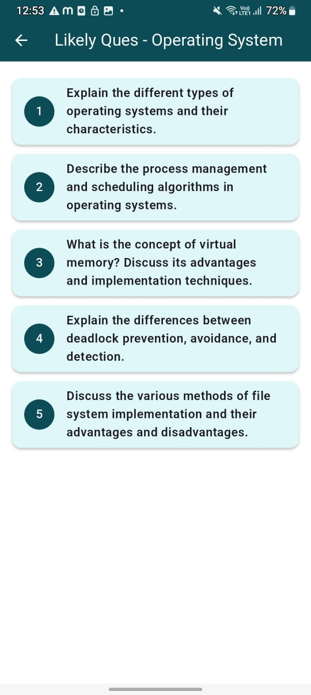
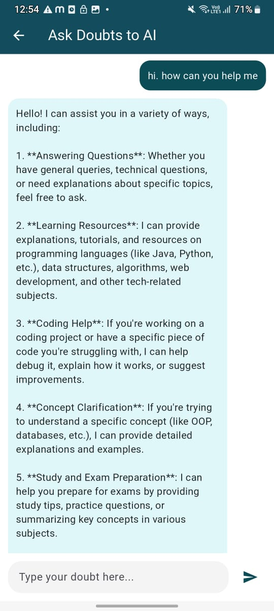

# 🎓 SmartGTU — AI-Powered GTU Exam Prep App

SmartGTU is an AI-powered study companion for Gujarat Technological University (GTU) students. It helps students prepare better by providing previous year question papers (PYQs), smart answer analysis, unit-wise practice, and AI-based predictions for likely questions.

---

## 🚀 Features (Work in Progress)

- 🗂️ GTU PYQs — organized by branch, semester, subject
- 🤖 Smart Answer Analyzer — AI feedback on answers with respect to GTU marking Scheme
- 🧑‍🏫 Likely to be Asked — AI predicts trending questions in GTU PYQs
- 📄 bookmarks
- 📊 Generate Quizzes based on GTU question papers
- 💬 AI Doubt Solving Chatbot

---

## ⚙️ Tech Stack

- Flutter
- Firebase Firestore & Auth
- OpenAI API 
- Prompt Engineering
- Clean Material UI

---

## 📅 Status

🟢 **This project is actively under development.**  
The source code is currently private but will be shared publicly soon!

---

## 📸 Screenshots

_Add UI screenshots here if you have them._

---

---

## 📌 Note

For demonstration and portfolio purposes only.
